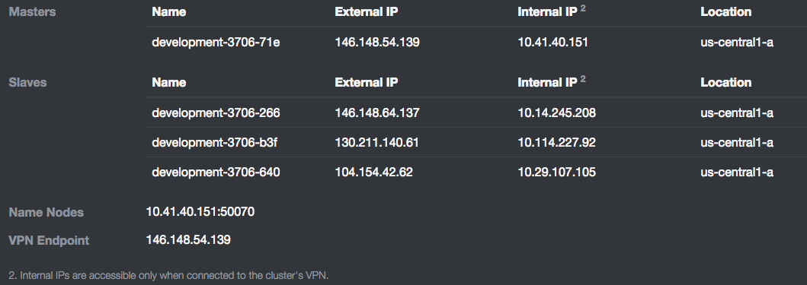

#Mesos-DNS在Google计算平台
这是一个Mesos-DNS和Mesosphere运行在Google计算平台的分步教程。
##步骤1：发布一个Mesosphere集群
发布一个Mesosphere开发集群说明在<https://google.mesosphere.com/>。注意：你需要一个以启动计费项目的<a href="https://cloud.google.com">Google云平台</a>帐号。
开发集群包含1个主节点和3个从节点。我们将示例集群中使用的信息在下面列出在教程中。注意：我们将在所有情况下所有节点使用内部IP地址。集群运行Mesos(版本 0.21.1)和Marathon(版本 0.7.6)。
 

<a href="https://cloud.google.com">Google云平台</a>默认限制了53端口。依照以下指示打开53端口。注意，53端口的tcp和udp通道都要打开。最后检查你的集群防火墙规则，确认有下面列出的规则，打开10.0.0.0子网主机的53端口tcp和udp通道。

##步骤2：构建安装Mesos-DNS
将在节点10.14.245.208上构建安装Mesos-DNS。可以通过ssh访问这个节点。
<pre><code>ssh jclouds@10.14.245.208</code></pre>

构建过程包括安装go：
<pre><code>sudo apt-get install git-core
wget https://storage.googleapis.com/golang/go1.4.linux-amd64.tar.gz
tar xzf go*
sudo mv go /usr/local/.
export PATH=$PATH:/usr/local/go/bin
export GOROOT=/usr/local/go
export PATH=$PATH:$GOROOT/bin
export GOPATH=$HOME/go
go get github.com/tools/godep
export PATH=$PATH:$GOPATH/bin</code></pre>

现在已经准备好编译Mesos-DNS：
<pre><code>go get github.com/mesosphere/mesos-dns
cd $GOPATH/src/github.com/mesosphere/mesos-dns
make all
sudo mkdir /usr/local/mesos-dns
sudo mv mesos-dns /usr/local/mesos-dns</code></pre>

在 (/usr/local/mesos-dns)统一目录下创建一个名字为config.json的文件并做如下修改：
<pre><code>$ cat /usr/local/mesos-dns/config.json 
{
  "zk": "zk://10.41.40.151:2181/mesos",
  "refreshSeconds": 60,
  "ttl": 60,
  "domain": "mesos",
  "port": 53,
  "resolvers": ["169.254.169.254","10.0.0.1"],
  "timeout": 5,
  "email": "root.mesos-dns.mesos"
}</code></pre>

resolvers字段包含在此集群中的节点的/etc/resolv.conf中列出了两个域名。
##步骤3：发布Mesos-DNS
从主节点10.41.40.151发布Mesos-DNS,可以通过ssh访问这个节点：
<pre><code>ssh jclouds@10.41.40.151</code></pre>

为了加强容错能力，将使用Marathon发布Mesos-DNS。如果Mesos-DNS崩溃，Marathon将重新启动Mesos-DNS。新建一个文件mesos-dns.json并修改为如下内容：
<pre><code>$ more mesos-dns.json 
{
"cmd": "sudo  /usr/local/mesos-dns/mesos-dns -v -config=/usr/local/mesos-dns/config.json",
"cpus": 1.0, 
"mem": 1024,
"id": "mesos-dns",
"instances": 1,
"constraints": [["hostname", "CLUSTER", "10.14.245.208"]]
}</code></pre>

使用如下命令发布Mesos-DNS：
<pre><code>curl -X POST -H "Content-Type: application/json" http://10.41.40.151:8080/v2/apps -d@mesos-dns.json</code></pre>

这个命令指示Marathon在节点10.14.245.208上发布Mesos-DNS。-v选项允许捕获Mesos-DNS warning/error详细日志可以用来调试。可以通过Mesos网页访问stdout和stderr日志，例如，http://10.41.40.151.5050。

#步骤4：配置集群节点
下一步，配置集群中所有的节点使用Mesos-DNS作为DNS服务。ssh访问每个节点并执行：
<pre><code>sudo sed -i '1s/^/nameserver 10.14.245.208\n /' /etc/resolv.conf</code></pre>

可以使用下面的命令验证配置的正确性和Mesos-DNS可以服务DNS查询：
<pre><code>$ cat /etc/resolv.conf 
nameserver 10.14.245.208
 domain c.myproject.internal.
search c.myprojecct.internal. 267449633760.google.internal. google.internal.
nameserver 169.254.169.254
nameserver 10.0.0.1
$ host www.google.com
www.google.com has address 74.125.70.104
www.google.com has address 74.125.70.147
www.google.com has address 74.125.70.99
www.google.com has address 74.125.70.105
www.google.com has address 74.125.70.106
www.google.com has address 74.125.70.103
www.google.com has IPv6 address 2607:f8b0:4001:c02::93</code></pre>

要100%确定Mesos-DNS实际服务提供上面的翻译，可以尝试：
<pre><code>$ sudo apt-get install dnsutils
$ dig www.google.com

; <<>> DiG 9.8.4-rpz2+rl005.12-P1 <<>> www.google.com
;; global options: +cmd
;; Got answer:
;; ->>HEADER<<- opcode: QUERY, status: NOERROR, id: 45045
;; flags: qr rd ra; QUERY: 1, ANSWER: 6, AUTHORITY: 0, ADDITIONAL: 0

;; QUESTION SECTION:
;www.google.com.            IN  A

;; ANSWER SECTION:
www.google.com.     228 IN  A   74.125.201.105
www.google.com.     228 IN  A   74.125.201.103
www.google.com.     228 IN  A   74.125.201.147
www.google.com.     228 IN  A   74.125.201.104
www.google.com.     228 IN  A   74.125.201.106
www.google.com.     228 IN  A   74.125.201.99

;; Query time: 3 msec
;; SERVER: 10.14.245.208#53(10.14.245.208)
;; WHEN: Sat Jan 24 01:03:38 2015
;; MSG SIZE  rcvd: 212</code></pre>

标记了SERVER的行明确表示，我们启动用于监听10.14.245.208节点53端口的进程可以应答。这就是Mesos-DNS。

##步骤5：用Msos发布nginx
现在发布一个任务使用Mesos。我们将使用nginx web服务使用Marathon和Docker发布。可以这样登录主节点：
<pre><code>ssh jclouds@10.41.40.151</code></pre>

首先新建一个名字为nginx.json的nginx配置文件：
<pre><code>$ cat nginx.json
{
  "id": "nginx",
  "container": {
    "type": "DOCKER",
    "docker": {
      "image": "nginx:1.7.7",
      "network": "HOST"
    }
  },
  "instances": 1,
  "cpus": 1,
  "mem": 640,
  "constraints": [
    [
      "hostname",
      "UNIQUE"
    ]
  ]
}</code></pre>

可以使用如下命令在主节点上发布它：
<pre><code>curl -X POST -H "Content-Type: application/json" http://10.41.40.151:8080/v2/apps -d@nginx.json</code></pre>

这样可以使用Docker和host网络在三个从节点的任意一个上发布它。可以使用Marathon的web页面来验证是否运行正常。结果是Mesos在节点10.114.227.92上发布了它，并且可以使用如下命令验证它是否正常工作：
<pre><code>$ curl http://10.114.227.92
&#60;!DOCTYPE html&#62;
&#60;html&#62;
&#60;head&#62;
&#60;title&#62;Welcome to nginx!&#60;/title&#62;
&#60;style&#62;
    body {
        width: 35em;
        margin: 0 auto;
        font-family: Tahoma, Verdana, Arial, sans-serif;
    }
&#60;/styl&#62;
&#60;/head&#62;
&#60;body&#62;
&#60;h1&#62;Welcome to nginx!&#60;/h1&#62;
&#60;p&#62;If you see this page, the nginx web server is successfully installed and
working. Further configuration is required.&#60;/p&#62;

&#60;p&#62;For online documentation and support please refer to
&#60;a href="http://nginx.org/"&#62;nginx.org&#60;/a&#62;.&#60;br/&#62;
Commercial support is available at
&#60;a href="http://nginx.com/"&#62;nginx.com&#60;/a&#62;.&#60;/p&#62;

&#60;p&#62;&#60;em&#62;Thank you for using nginx.&#60;/em&#62;&#60;/p&#62;
&#60;/body&#62;
&#60;/html&#62;</code></pre>

##步骤6：使用Mesos-DNS链接nginx
现在让我们使用Mesos-DNS连接nginx，使用预期名字 nginx.marathon-0.7.6.mesos。Marathon版本号是因为注册在Mesos使用的名字marathon-0.7.6。我们可以使用 --framework_name marathon发布Marathon来避免这个问题：
<pre><code>$ dig nginx.marathon-0.7.6.mesos

; <<>> DiG 9.8.4-rpz2+rl005.12-P1 <<>> nginx.marathon-0.7.6.mesos
;; global options: +cmd
;; Got answer:
;; ->>HEADER<<- opcode: QUERY, status: NOERROR, id: 11742
;; flags: qr aa rd ra; QUERY: 1, ANSWER: 1, AUTHORITY: 0, ADDITIONAL: 0

;; QUESTION SECTION:
;nginx.marathon-0.7.6.mesos. IN A

;; ANSWER SECTION:
nginx.marathon-0.7.6.mesos. 60 IN   A   10.114.227.92

;; Query time: 0 msec
;; SERVER: 10.14.245.208#53(10.14.245.208)
;; WHEN: Sat Jan 24 01:11:46 2015
;; MSG SIZE  rcvd: 96</code></pre>

Mesos-DNS通知我们nginx是运行在节点10.114.227.92.。现在让我们连接它：
<pre><code>$ curl http://nginx.marathon-0.7.6.mesos
&#60;!DOCTYPE html&#62;
&#60;html&#62;
&#60;head&#62;
&#60;title&#62;Welcome to nginx!&#60;/title&#62;
&#60;style&#62;
    body {
        width: 35em;
        margin: 0 auto;
        font-family: Tahoma, Verdana, Arial, sans-serif;
    }
&#60;/styl&#62;
&#60;/head&#62;
&#60;body&#62;
&#60;h1&#62;Welcome to nginx!&#60;/h1&#62;
&#60;p&#62;If you see this page, the nginx web server is successfully installed and
working. Further configuration is required.&#60;/p&#62;

&#60;p&#62;For online documentation and support please refer to
&#60;a href="http://nginx.org/"&#62;nginx.org&#60;/a&#62;.&#60;br/&#62;
Commercial support is available at
&#60;a href="http://nginx.com/"&#62;nginx.com&#60;/a&#62;.&#60;/p&#62;

&#60;p&#62;&#60;em&#62;Thank you for using nginx.&#60;/em&#62;&#60;/p&#62;
&#60;/body&#62;
&#60;/html&#62;</code></pre>

使用一个逻辑名字成功连接nginx。Mesos-DNS开始工作。
##步骤7：扩展nginx
使用Marathon web页面修改nginx为两个实例。或者，编辑步骤5修改json文件中instances为2重新启动它。一分钟以后，我可以使用Mesos-DNS再次查看它并得到：
<pre><code>$  dig nginx.marathon-0.7.6.mesos

; <<>> DiG 9.8.4-rpz2+rl005.12-P1 <<>> nginx.marathon-0.7.6.mesos
;; global options: +cmd
;; Got answer:
;; ->>HEADER<<- opcode: QUERY, status: NOERROR, id: 30550
;; flags: qr aa rd ra; QUERY: 1, ANSWER: 2, AUTHORITY: 0, ADDITIONAL: 0

;; QUESTION SECTION:
;nginx.marathon-0.7.6.mesos. IN A

;; ANSWER SECTION:
nginx.marathon-0.7.6.mesos. 60 IN   A   10.29.107.105
nginx.marathon-0.7.6.mesos. 60 IN   A   10.114.227.92

;; Query time: 1 msec
;; SERVER: 10.14.245.208#53(10.14.245.208)
;; WHEN: Sat Jan 24 01:24:07 2015
;; MSG SIZE  rcvd: 143</code></pre>

现在Mesos-DNS给我们返回两个相同名字的A记录，确定我们集群上有两个nginx实例。